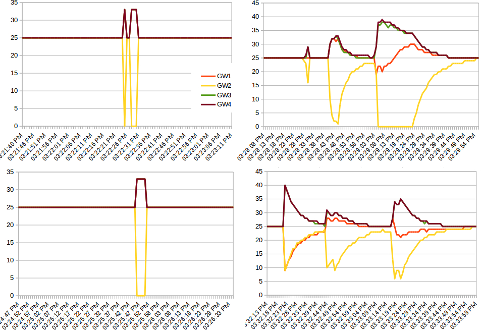

## about kamamilio_load_balancing repository

This repository was created to document the work made on an new algorithm for Kamailio dispatcher module
as well as the tools used and some test results 

## New algorithm
relative weight based load distribution with congestion detection

### Congestion detection is done using average AVG (normal gateway latency) and EWMA EST (current gateway latency estimator)

congestion_ms : The estimated congestion in ms is EST - AVG and always >= 0

#### The reactivity when facing congestion can be tuned using the EWMA alpha
A larger alpha will result in an estimator with a longer memory and slower reaction time  

```
Default value is “900 => 0.9” # meaning a new sample will weight 10% of the current AVG 
modparam("dispatcher", "ds_latency_estimator_alpha", 900)
```

#### The load sent to a gateway is lowered by one point of weight for every congestion_ms

In this example the GW wills support up to 50ms of estimated congestion, therefore 50 is also the Cut-Off value.
However, the GW will still be used if all the other GWs are also above their congestion threshold, in such case, load distribution will now be based on the ratio of congestion_ms each GW is facing.

```
INSERT INTO "dispatcher" VALUES(1,1,'sip:1.1.1.1:5072',0,12,'weight=50;rweight=50','');
INSERT INTO "dispatcher" VALUES(2,1,'sip:1.1.1.1:5073',0,12,'weight=50;rweight=50','');
INSERT INTO "dispatcher" VALUES(3,1,'sip:2.2.2.2:5072',0,12,'weight=50;rweight=50','');
INSERT INTO "dispatcher" VALUES(4,1,'sip:2.2.2.2:5073',0,12,'weight=50;rweight=50','');
```


## Test result example 
[spreadsheet](https://github.com/jchavanton/kam_load_balancing/blob/master/A-B.ods)

A [voip_perf](https://github.com/jchavanton/voip_perf)  user agent is generating 600CPS to a Kamailio load balancer that is configured with the default settings documented above, it will try to distribute the traffic to the 4 GW (voip_perf servers) evenly 25%/25%/25%/25%

* GW 1 : will be affected by the stress command [shell script](https://github.com/jchavanton/kam_load_balancing/blob/master/scenario/server3.sh) 
* GW 2 : will be affected by the stress command and is permanently receiving an extra 150CPS [shell script](https://github.com/jchavanton/kam_load_balancing/blob/master/scenario/server3.sh) 
* GW 3 : is performaning normaly [shell script](https://github.com/jchavanton/kam_load_balancing/blob/master/scenario/server1.sh) 
* GW 4 : is performaning normaly [shell script](https://github.com/jchavanton/kam_load_balancing/blob/master/scenario/server1.sh) 


type|test#|AVG180_S|AVG200_S|TIMEOUT|RECEIVED
----|-----|--------|--------|-------|--------
lb off|3|0.135|1.728|251|49749
lb off|4|0.038|0.953|337|49663
lb on (congestion detection)|3|0.080|0.980|0|50000
lb on (congestion detection)|4|0.011|0.915|0|50000
lb off (test_yul2.ods)|5|157|688|0|50000
lb on (congestion detection)|5|149|660|0|50000
lb off (test_yul.ods)|6|179|709|216|49784
lb on (congestion detection) |6|147|662|0|50000

[voip_perf result files](https://github.com/jchavanton/kam_load_balancing/tree/master/stats)

* on the left side : (lb off) relative weight based load distribution is used
* on the right side : (lb on) relative weight based load distribution with congestion detection is used

Load balancing in % per GW


[Python script using dispatcher.list](https://github.com/jchavanton/kam_load_balancing/blob/master/scenario/ds_check.pl)
